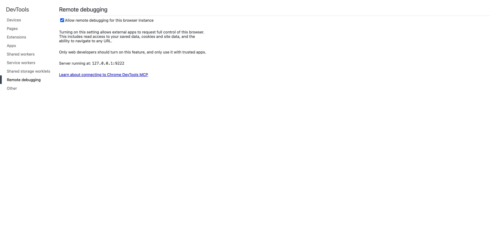
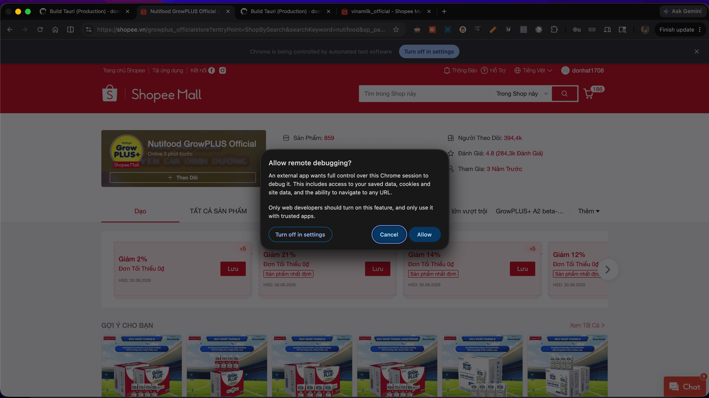

# crawl-shopee-with-python

Crawl sản phẩm từ Shopee (theo shop hoặc từ khóa tìm kiếm) sử dụng Chrome DevTools Protocol — không bị bot detection.

**Dữ liệu thu thập:** tên sản phẩm, giá, rating, số đã bán, link sản phẩm.  
**Output:** file CSV hoặc JSON + GIF ghi lại quá trình crawl.

---

## Yêu cầu

- Python 3.10+
- Google Chrome (bản desktop, không phải Chromium riêng)

---

## Cài đặt

```bash
python -m venv .venv
source .venv/bin/activate      # Windows: .venv\Scripts\activate
pip install -r requirements.txt
```

---

## Cách chạy

### Bước 1 — Bật Remote Debugging trên Chrome

1. Mở Chrome, vào địa chỉ: 
    **`chrome://inspect/#remote-debugging`**
2. Tích chọn **"Allow remote debugging for this browser instance"**
3. Màn hình hiển thị: `Server running at: 127.0.0.1:9222` → Chrome đã sẵn sàng



> **Lưu ý:**
> - Chỉ cần làm một lần, Chrome sẽ nhớ setting này cho đến khi bỏ tích.
> - Nếu port hiển thị **khác `9222`** (vd: `127.0.0.1:9333`), hãy ghi lại — cần truyền thêm `--port 9333` khi chạy script ở Bước 2.
> - Nếu muốn dùng full URL, copy dòng `Server running at: 127.0.0.1:9222` và dùng `--remote-url 127.0.0.1:9222` (hoặc dạng đầy đủ `ws://127.0.0.1:9222/devtools/browser`).

### Bước 2 — Chạy script

**Crawl theo tên shop:**
```bash
python crawler.py --shops vinamilk10tantrao
```

**Crawl nhiều shop cùng lúc:**
```bash
python crawler.py --shops vinamilk10tantrao growplus_officialstore
```

**Crawl bằng URL đầy đủ** (kể cả URL có query string):
```bash
python crawler.py --shops "https://shopee.vn/th_truemart_officialstore?categoryId=100629&itemId=123"
```

**Crawl theo từ khóa tìm kiếm:**
```bash
python crawler.py --keyword "sữa bột"
```

> **Lưu ý:**
> - **Nếu port Chrome khác `9222`** (xem lại Bước 1), thêm `--port PORT` vào lệnh, vd:
>   ```bash
>   python crawler.py --shops vinamilk10tantrao --port 9333
>   ```
> - Hoặc dùng full URL với `--remote-url` (hỗ trợ cả dạng rút gọn `ip:port`):
>   ```bash
>   # Dạng rút gọn — tự động thêm ws:// và /devtools/browser
>   python crawler.py --shops vinamilk10tantrao --remote-url 127.0.0.1:9333
>
>   # Dạng đầy đủ
>   python crawler.py --shops vinamilk10tantrao --remote-url ws://127.0.0.1:9333/devtools/browser
>   ```
> - **Windows:** Kích hoạt venv bằng `.venv\Scripts\activate` thay vì `source .venv/bin/activate`.

### Bước 3 — Approve dialog trên Chrome

Khi chạy script lần đầu, Chrome hiển thị dialog:



→ Click **Allow** để script tiếp tục.

> Nếu không thấy dialog, script sẽ tự retry trong 30 giây.

### Bước 4 — Kết quả

Script tự động lưu file vào thư mục hiện tại:

| File | Nội dung |
|------|----------|
| `{shop}-{timestamp}.csv` | Dữ liệu sản phẩm (mở bằng Excel) |
| `{shop}-{timestamp}.gif` | GIF ghi lại quá trình crawl |

---

## Tùy chọn

| Tham số | Mặc định | Mô tả |
|---------|----------|-------|
| `--shops` | — | Tên shop hoặc URL (có thể truyền nhiều) |
| `--keyword` | — | Từ khóa tìm kiếm |
| `--site` | `shopee.vn` | Domain (vd: `shopee.sg`) |
| `--limit` | `10000` | Số sản phẩm tối đa mỗi shop |
| `--format` | `csv` | Định dạng output: `csv` hoặc `json` |
| `--output` | auto | Base name file output (không cần extension) |
| `--no-record` | — | Tắt ghi GIF |

**Ví dụ nâng cao:**
```bash
# Lấy tối đa 100 sản phẩm, output JSON, không ghi GIF
python crawler.py --shops vinamilk10tantrao --limit 100 --format json --no-record

# Đặt tên file output tùy chỉnh
python crawler.py --shops vinamilk10tantrao --output vinamilk-data
```

---

## Lưu ý

- Script dùng Chrome thật (không phải headless) nên **không bị Shopee phát hiện bot**.
- Không cần đăng nhập Shopee — crawl được public data.
- Nếu gặp CAPTCHA, đóng tab Shopee trong Chrome và thử lại.